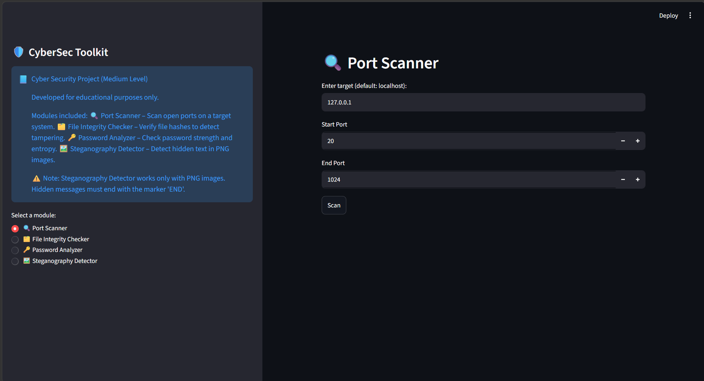
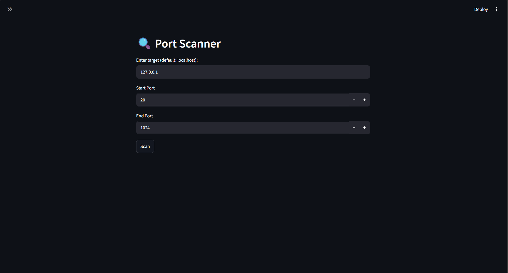
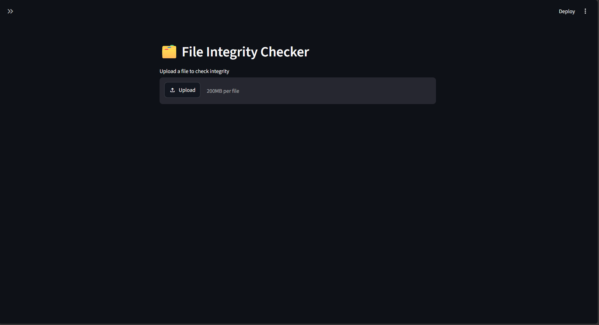
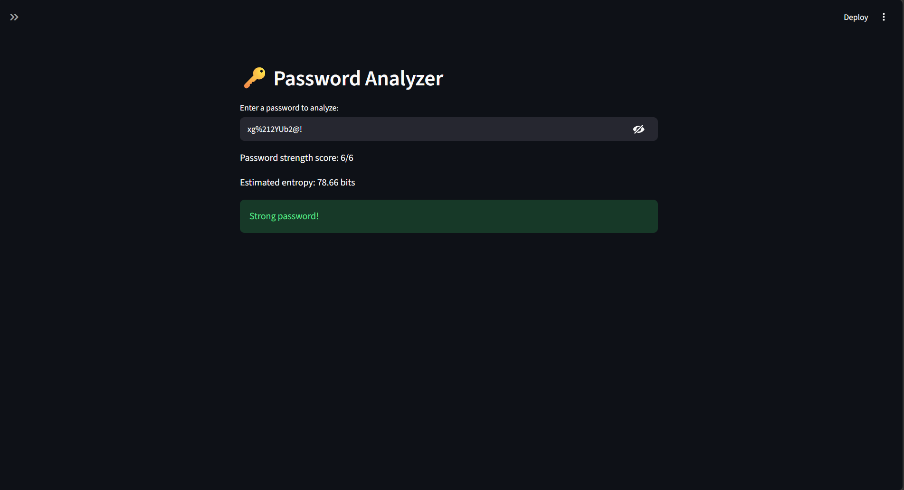
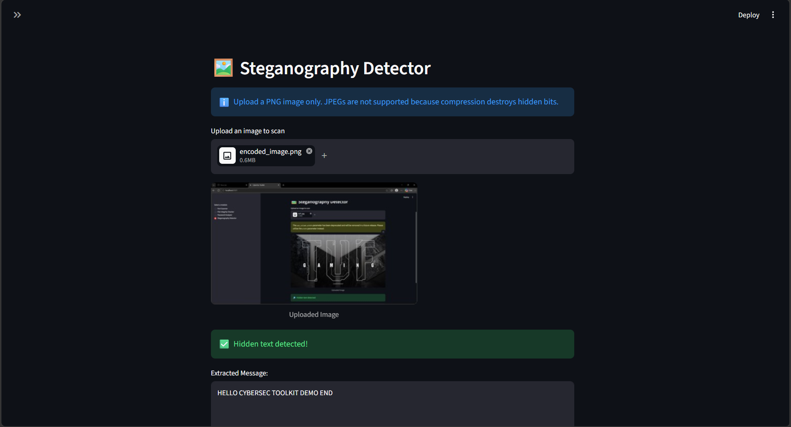

# 🛡️ CyberSec Toolkit

A **Streamlit-based Cyber Security Toolkit** demonstrating practical cybersecurity concepts through an interactive web interface.

Developed for **educational purposes only** by **Pranay P Patil**,  
**Computer Science & Engineering (CSE) Student**  
**KLS Gogte Institute of Technology, Belgaum**

🔗 **GitHub:** https://github.com/Pranay-Pandurang-Patil

---

# 📘 Overview

CyberSec Toolkit is a medium-level cybersecurity project built using **Python** and **Streamlit**. It helps students and cybersecurity enthusiasts understand essential security concepts through hands-on experimentation.

The toolkit provides multiple security modules through an intuitive graphical interface, allowing users to explore cybersecurity concepts without relying solely on command-line tools.

> **Note:** This project is intended for educational and demonstration purposes only.

---

# ✨ Features

## 🔍 Port Scanner
- Scan common TCP ports on a target IP address or domain.
- Detect open ports.
- Fast and beginner-friendly interface.

---

## 🗂️ File Integrity Checker
- Generate secure file hashes.
- Verify file integrity.
- Detect accidental or unauthorized modifications.

---

## 🔑 Password Strength Analyzer
- Analyze password complexity.
- Check password strength.
- Evaluate password entropy.
- Suggest improvements for stronger passwords.

---

## 🖼️ Steganography Detector
- Extract hidden text from PNG images using LSB (Least Significant Bit) analysis.
- Detect concealed messages inside images.
- Supports educational steganography demonstrations.

**Limitations**
- Only PNG images are supported.
- Hidden messages must end with the marker:

```
END
```
## 🌐 Live Demo

Try the deployed application here:

**[🚀 Open Live Demo](https://cybersec-toolkit.streamlit.app/)**

> ⚠️ **Note:** The Streamlit app may temporarily show an **"Inactive"** state when it has not been accessed for some time.
>
> If this happens, click **"Inactive"** and return to the project/app page to activate it. Then wait a few seconds for the application to start.
>
> This is related to Streamlit Community Cloud's app sleep/inactivity behavior and does not indicate a problem with the project.

---

# 📂 Project Structure

```
CyberSec-Toolkit/
├── main.py
├── modules/
│   ├── port_scanner.py
│   ├── file_integrity.py
│   ├── password_analyzer.py
│   └── steganography_detector.py
├── requirements.txt
├── README.md
└── assets/
    └── screenshots/

```

---

# 🛠️ Technologies Used

- Python 3.x
- Streamlit
- NumPy
- Pillow (PIL)
- Socket Programming
- Hashlib

---

# ⚙️ Installation

## 1. Clone the repository

```bash
git clone https://github.com/PranayPPatil/CyberSec-Toolkit.git
```

---

## 2. Navigate to the project folder

```bash
cd CyberSec-Toolkit
```

---

## 3. Install dependencies

```bash
pip install -r requirements.txt
```

If you don't have a `requirements.txt`, install manually:

```bash
pip install streamlit pillow numpy
```

---

# 🚀 Running the Project

Start the Streamlit application:

```bash
streamlit run main.py
```

After launching, open your browser and visit:

```
http://localhost:8501
```

---

# 📖 Usage

Choose a module from the sidebar.

### 🔍 Port Scanner

- Enter a target IP address or domain.
- Click **Scan**.
- View detected open ports.

---

### 🗂️ File Integrity Checker

- Upload a file.
- Generate its hash.
- Compare hashes to verify integrity.

---

### 🔑 Password Analyzer

- Enter a password.
- View:
  - Password Strength
  - Entropy
  - Security Suggestions

---

### 🖼️ Steganography Detector

- Upload a PNG image.
- Extract hidden text.
- Display decoded message (if present).

---

# 📸 Screenshots

## 🏠 Home Screen

Main dashboard of the CyberSec Toolkit.



---

## 🔍 Port Scanner

Scan a target IP address or domain to identify open TCP ports.



---

## 🗂️ File Integrity Checker

Generate and verify secure file hashes to ensure file integrity.



---

## 🔑 Password Strength Analyzer

Analyze password strength, entropy, and receive security recommendations.



---

## 🖼️ Steganography Detector

Extract hidden text from PNG images using LSB (Least Significant Bit) analysis.



---

# 🎯 Learning Objectives

This project demonstrates the practical implementation of the following cybersecurity and software development concepts:

- TCP Network Programming
- TCP Port Scanning
- Password Strength Analysis and Entropy Calculation
- Cryptographic Hash Functions for File Integrity Verification
- Least Significant Bit (LSB) Steganography Detection
- Secure Python Programming Practices
- Interactive Web Application Development using Streamlit
- Ethical Cybersecurity Principles and Responsible Use

---

# ⚠️ Disclaimer

This project is developed **strictly for educational purposes**.

It is intended to demonstrate cybersecurity concepts in a safe and ethical environment.

Do **NOT** use this toolkit against systems or networks without proper authorization.

The author is **not responsible** for any misuse of this software.

---

# 📜 License

This project is licensed under the **MIT License**.

You are free to use, modify, and distribute this project with proper attribution.

---

# 👨‍💻 Author

**Pranay P Patil**

Computer Science & Engineering (CSE) Student

KLS Gogte Institute of Technology, Belgaum

GitHub: https://github.com/Pranay-Pandurang-Patil

---

## ⭐ Support

If you found this project useful, consider giving it a ⭐ on GitHub.

